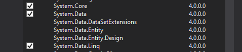

# Book adatbázisos feladat - Midterm No.2

Ez a project a **Book adatbázis feladat**, a második beadandó a 3 midterm beadandó közül. A Project **Visual Studio**-ban íródott, a template: **Websharper 4 Client-Server Application (.NET Framework)**

A befejezett project kinézete:

# Fontos file-ok

A legfontosabb három file az **Main.html**, **Client.fs** és a **Remoting.fs** file, elsőa html file, második a kliens oldali F# kódot tartalmazza, az utolsó pedig a szerver oldali **Rpc** hívásokat és egyéb szerver-oldali kódot tartalmaz, szintén F#-ban írva.

# A project állapota

Amint látható, a projectben nincs implementálva az alap 3 funkció mindegyike, "csak" 2, azaz lehet **a könyveket listázni**, és lehet **az adatbázishoz hozzáadni**. 

Emellett viszont implementálva van az extra funkció, ami SQL serverrel oldja meg az adatok tárolását (+15 pont).

# Project működéséhez szükséges lépések

- VS codeban megnyitjuk a solution file-t, ha esetleg új projectet nyitunk, mindenképp a már fentebb említett **Websharper 4 Client-Server Application (.NET Framework)** kell, mert a **.NET core** verzió nem fog működni, a project során használt **SQL Provider**miatt, ami csak az előbbivel kompatibilis.

- Szükség lesz egy SQL serverre is, hiszen az app azzal kommunikál, ott tárolja a könyveket. Az adatbázist és a szükséges táblákat az **Adatbfeltoltes.sql** file elvégzi nekünk, ha **Microsoft  SQL Server Management Studio** *(innentől: SSMS)*-val lefuttatjuk a scriptet. **SQL Server Express**-t innen tölthetjük le: [SQL Server letöltése](https://www.microsoft.com/en-us/download/confirmation.aspx?id=55994)

- Mivel hogy ezt a scriptet, mint mondtam le kell futtatni, ezért az **SSMS** is kell, ha nincs telepítve. Link ahol letölthetjük: [SSMS letöltése](https://aka.ms/ssmsfullsetup)

- Ha mindez megvan, akkor az **SSMS**-ben rányomunk a **script megnyitásra** 

- Ha a file sikeresen megnyílt, akkor jöhet a **script futtatása**. Ezt SSMS-ben a következő gombra kattintással tehetjük meg (vagy **F5**-öt nyomunk):

- A script egyébként annyit csinál, hogy megnézi létezik-e a **Test** nevű adatbázis, ha igen, akkor törli, majd létrehoz egy új **Test** adatbázist. Ezt követően ugyanezt a folyamatot megteszi a **Book** nevű táblával, majd végül feltölti pár teszt adattal, hogy legyen a programnak mivel dolgozni. A kódja nem túl hosszú, így néz ki:

- Ha ezzel is megvagyunk, akkor át kell menni a **Visual Studio**-ba és ott is beállítani pár dolgot. Először is legyen feltelepítve és aktiválva az **SQL Provider** nevű **NuGet Package**, ezt jobb oldalt a **References**-re kattintva tehetjük meg. 

- Itt, ha az **Installed** fülön nem találjuk meg, akkor a **Browse** fülön kikeressük, majd telepítjük. Ezt kell keresni:

- Ezek után mégvalamit be kell állítanuk a **References**-el kapcsolatban, kattintsunk rá jobb-klikkel majd válasszuk az első opciót, azaz **Add Reference...**. Itt az **Assemblies** menüpontban keressünk ki 2 dolgot, és pipáljuk be a kis négyzetet a sorok elején: **System.Data** és **System.Data.Linq**:

- Egyetlen lépésre vagyunk attól, hogy a program indítható legyen, ezt sajnos kézzel kell átírni, mert nem tudtam megoldani scripttel. Ez a lépés pedig a kódban a szerver nevének beállítása, ezt azért kell kézzel beállítani, mert gépről gépre változhat. Ezt a **Remoting.fs** **29. sorában** találhatjuk, itt a **Server=** utáni részt kell átírni arra a szerver névre, ami az **SSMS**-ünk ablakának tetején is látható, lényegében arra, ami az **SQL Server** telepítésekor létrejött szerver név. Ez itt található: 

	És ezt kell átírni a **ConnectionString**-ben:
	

# A projekt futtatása

Ha mindent megtettünk az előző bekezdésből, akkor a szokásos módon, a **Visual Studio** felső menüjében található gombbal elindítható a project, és sikeresen le is kell futnia:

 Ha minden rendben ment, egy böngésző ablak fog nyílni, ahol a project elején lévő látvány kell hogy fogadjon minket. Itt ki tudjuk listázni az adatbázisban eltárolt könyveket, és tudunk új könyvet is betenni. Ha az új könyvet beraktuk és azt szeretnénk az összes könyv között látni, akkor kattintsunk újra a listázásra, hogy azt is kilistázza.

- Listázás:

- Hozzáadás:
